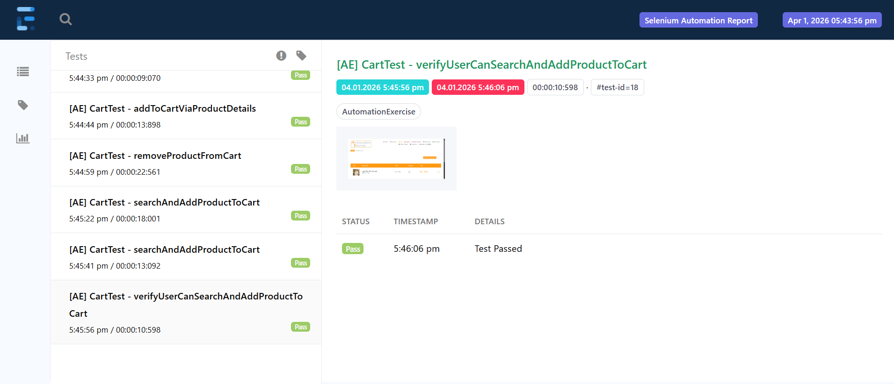
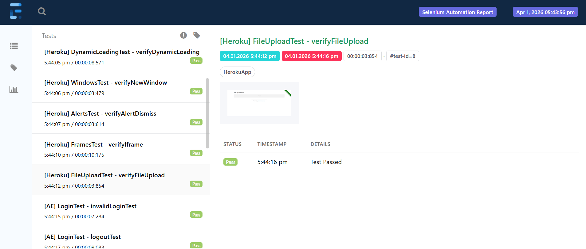

# Web Automation (Selenium + TestNG)

## Overview

This project is a Selenium-based automation framework built to test web applications like AutomationExercise and Heroku.
It covers core user flows such as login, form handling, alerts, and file uploads.

---

## Tech Stack

* Java
* Selenium WebDriver
* TestNG
* Maven

---

## Features

* Page Object Model (POM) for better structure
* Test scenarios covering login, forms, alerts, and file upload
* TestNG execution using `testng.xml`
* Extent Reports for HTML reporting
* Reusable utilities for driver setup and common actions

---

## Project Structure

```
src/
 ├── main/java
 ├── main/resources
 ├── test/java
 ├── test/resources
testng.xml
pom.xml

```

---

## How to Run

```
mvn clean test
```

---

## Sample Execution





---

## Reports

Test execution reports are generated in:

- `test-output/` → TestNG default reports  
- `reports/` → Extent Reports (HTML)

---

## Author

Deepika R
